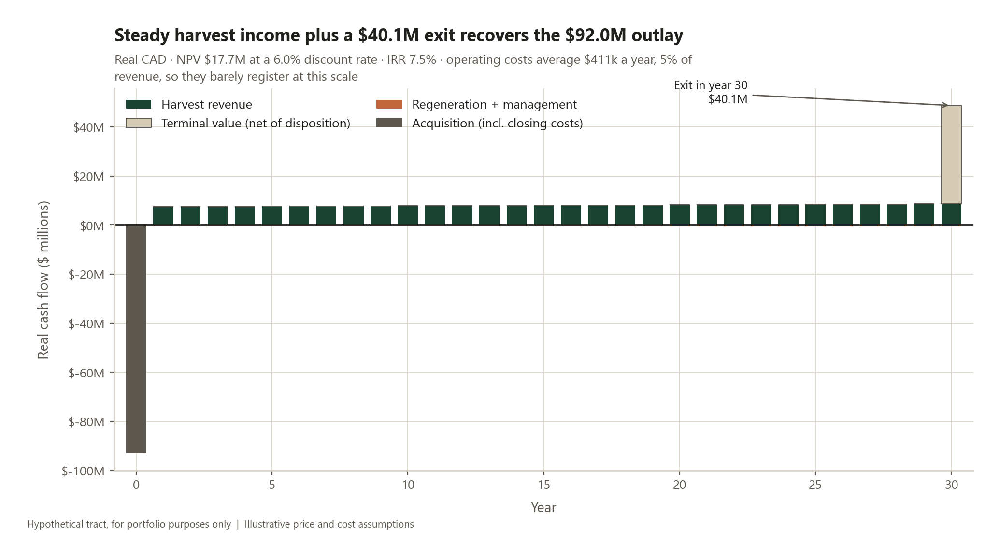
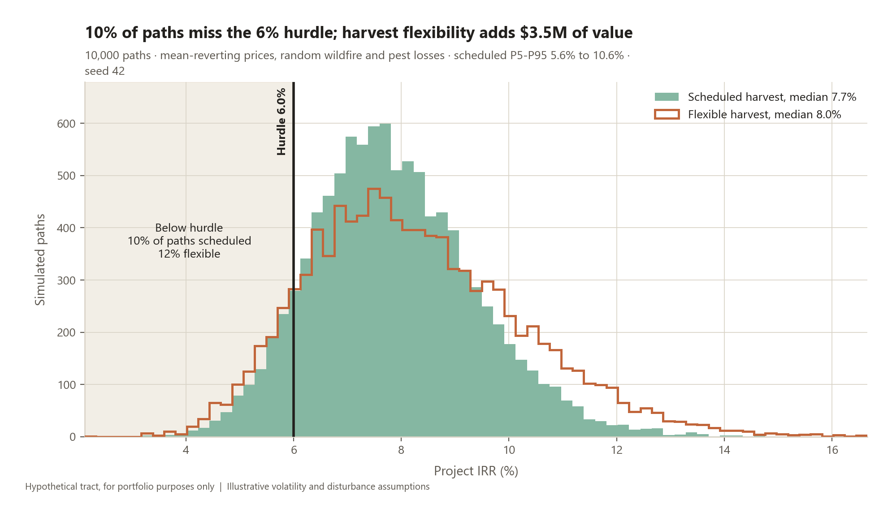
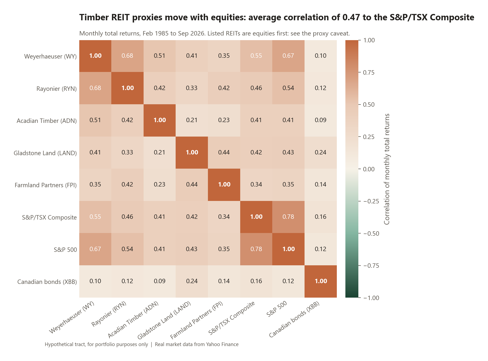

# Project Aspen: Timberland Acquisition Analysis

**The tract is hypothetical.** Every assumption about it is illustrative. The method is the deliverable, not the answer. Market data in the portfolio-fit section is real and cited.

A pension fund is offered **20,000 ha of Alberta boreal mixedwood for CAD 92M**. Should they buy, at what price, and what can go wrong? The model is a Chapman-Richards yield curve, Faustmann rotation, 30-year even-flow DCF, 10,000-path Monte Carlo (wildfire plus harvest-timing option), then a real-data test of the diversification and inflation pitch. One command rebuilds everything.

**Recommendation: buy below CAD 109.5M.** At the ask the tract returns **7.52% real** vs a **6.0% hurdle** (NPV CAD 17.7M, 2.91x). About **10% of paths still miss**. Adequately priced, not a bargain.

| | |
| --- | --- |
| IRR / NPV / MOIC | **7.52%** · **CAD 17.71M** · **2.91x** |
| Breakeven | **CAD 109.54M** (CAD 5,477/ha), +19% over ask |
| Faustmann / max-MAI | **29.7 yrs** / **63.5 yrs** · LEV **CAD 123/ha** |
| Sustainable cut | **155,919 m³/yr** · inventory 3.58M → 0.50M m³ |
| Risk (10k paths) | P(IRR < hurdle) **9.6%** · P5–P95 **5.6–10.6%** |
| Flexibility / fire | **CAD 3.53M** option · **CAD 1.12M** expected disturbance |
| Portfolio fit | timber–TSX corr **0.47** · **0 of 8** significant inflation betas |

Excel (live formulas), IC deck, one-page PDF: [`outputs/`](outputs/).

```bash
python -m venv .venv && .venv/Scripts/activate   # source .venv/bin/activate on macOS/Linux
pip install -r requirements.txt
python run_all.py            # ~25 s; --offline uses cache; --quick is 1,000 paths
pytest -q                    # 98 tests, including evaluating the Excel formulas
```

Python 3.10+. `config/assumptions.yaml` holds every input with a source field; **40 of 47 are invented**. Open the xlsx in Excel or LibreOffice (formulas calculate on open).





The Faustmann rotation is ~30 years because the yield curve is invented; real Alberta boreal is 70–100. Listed REITs are an equity-beta upper bound on private timberland correlation. Inflation betas are underpowered. Regulatory and Indigenous consultation risk is named, not quantified.

*Harsit Baral. The tract is hypothetical; the method is not.*
